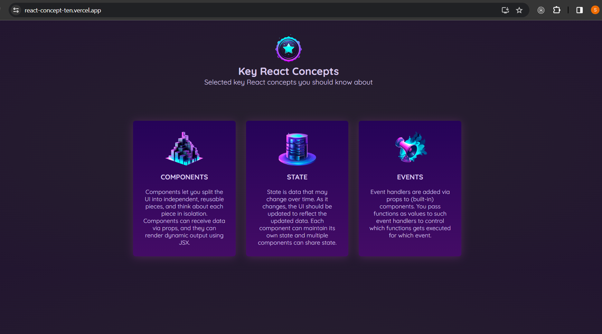

This React application serves as the initial step in familiarizing with essential React concepts through a visually appealing interface. It includes components like Header and Concept, with the Header displaying a title, image, and description introducing the concepts, while Concept components represent individual concepts with images, titles, and descriptions. 

Domain: https://react-concept-ten.vercel.app/

